### Requirements

- Java 17.0.6 or newer (Java 17+ required)
- Node.js 18.18.2 or newer
- npm 9.8.1 or newer
- **Docker**:
    - Docker Engine `20.10.22` or newer
    - Docker Compose `v2.15.1` or newer
    - At least **4 GB of free system RAM** recommended for Kafka/Zookeeper containers

> ✅ Ensure Docker is running before starting Kafka.
> - On **Windows/macOS**: Start Docker Desktop
> - On **Linux**: Run `sudo systemctl start docker`

### Running the project

1. Navigate to the `krakenservice` folder that contains the `docker-compose.yml` file:

```bash
cd krakenservice
docker-compose up -d
```
### 2. Start All Spring Boot Microservices

From the project root (`crypto-trading-sim`), run the PowerShell startup script:

```powershell
.\start-all.ps1
```

This will open a new PowerShell window for each microservice and start it using Maven. You will see real-time logs in each window.

---
To stop all Spring Boot microservices and close their PowerShell windows, run the following script from the project root (`crypto-trading-sim`):

```powershell
.\stop-all.ps1
```

This script will:

- Terminate all running Spring Boot services by stopping their `java` processes.
- Close the PowerShell windows that were opened by the `start-all.ps1` script.

> ⚠️ This will stop **all** Java processes related to the services. Make sure you're not running other important Java applications at the same time.

### 🌐 Service Endpoints

| Service                    | Description                    | URL                          |
|---------------------------|--------------------------------|------------------------------|
| 🧭 **Eureka Server**       | Service discovery dashboard    | [http://localhost:8761](http://localhost:8761) |
| 🚪 **API Gateway**         | Entry point for all APIs       | [http://localhost:8080](http://localhost:8080) |
| 👤 **User Service**        | Handles user data & balances   | [http://localhost:8081](http://localhost:8081) |
| 📊 **Market Data Streamer**| Streams crypto price updates   | [http://localhost:8082](http://localhost:8082) |
| 🐙 **Kraken Service**      | WebSocket client for Kraken API| [http://localhost:8083](http://localhost:8083) |
| 🖥️ **Frontend (React)**    | Web UI for users               | [http://localhost:5173](http://localhost:5173) or [http://localhost:5174](http://localhost:5174) |


### 🧑‍💼 Admin Credentials (for local development)

The following default credentials can be used to log in:

| Username | Password         |
|----------|------------------|
| `admin`  | `plaintextpassword` |
### Demo

Watch the demo video on 

LAST MVP DEMO: [Google Drive](https://drive.google.com/file/d/1Df_ysL3VG8Q4QJJO5fFXwgJ12sW8g4Pp/view?usp=sharing)
FIRST MVP DEMO: [Google Drive](https://drive.google.com/file/d/1k9GvioiWBQe2OWV7eZ--5DymZnJuiDkN/view?usp=drive_link)

### Screenshots

#### Initial Application Screen (Top 20 Crypto Prices)
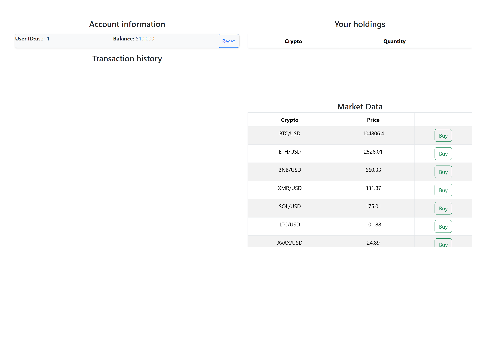
----
#### Buy Interface
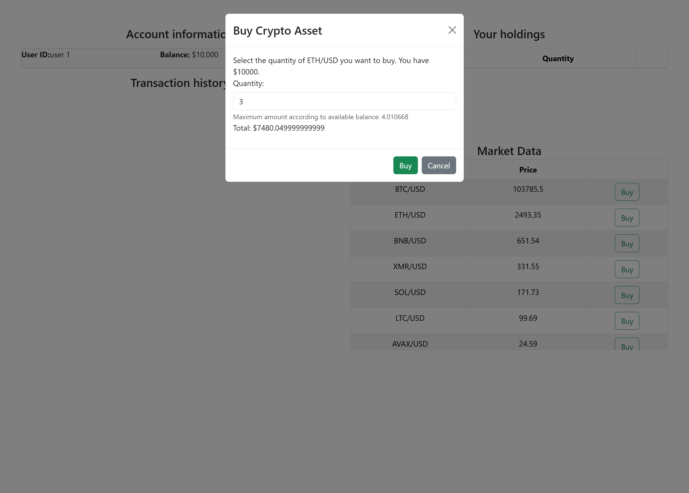
----
#### Sell Interface
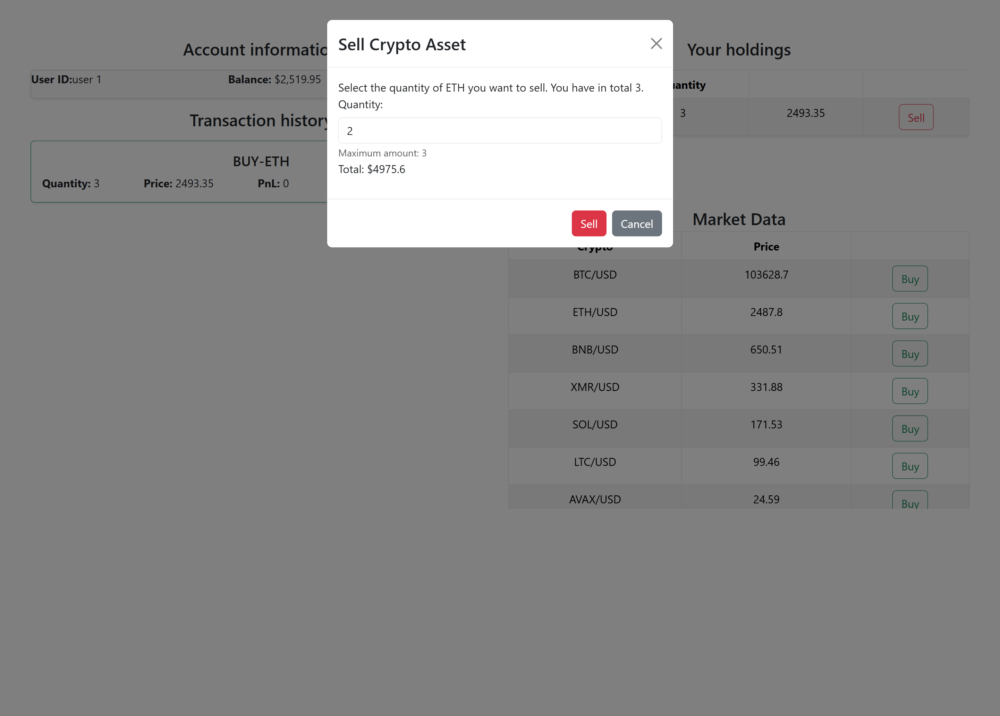
----
#### Updated Balance After Transaction


----

----
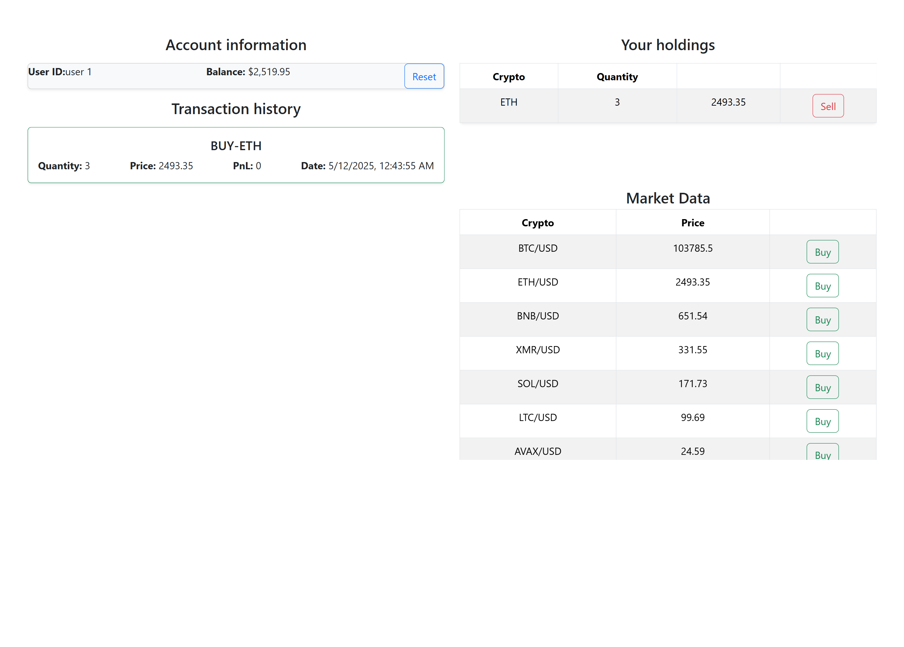
----
### Development Process

1. **Test-Driven Development (TDD) for the Backend**
    Applied TDD for the backend - first stub implementation was defined and then corresponding unit tests were implemented. Aimed for 100% (public) method coverage.
    First repositories and model classes were implemented and tested. Then followed by the service and controller layer.
   > **TDD Commit Examples:**  
   > [Commit 1: Define User & Transaction Repositories](https://github.com/bobelchev/crypto-sim/commit/dbb4594e9dcd0279473dcf389898fae826f77aa6)  
   > [Commit 2: Define CryptoHoldingRepository](https://github.com/bobelchev/crypto-sim/commit/45a4adcafc9b0eeae463841c47786c4f11b55096)  
   > [Commit 3: Implement Unit tests](https://github.com/bobelchev/crypto-sim/commit/45a4adcafc9b0eeae463841c47786c4f11b55096)  
   > [Commit 4: Implement User Repository class](https://github.com/bobelchev/crypto-sim/commit/f1f4e654f1178b225294f874bbf8788089c3d2b3)  
   > [Commit 5: Implement Transaction Repository class](https://github.com/bobelchev/crypto-sim/commit/52f4d371d29f2f8f312774ada86c312b9bc22c83)

2. **Branches**
    Once a stable minimally functional backend was developed the project branched out to develop the fronted and the WS connections.
   > **Branches:**
   > - [`frontend`](https://github.com/bobelchev/crypto-trading-sim/tree/frontend) – Implements the React frontend interface
   > - [`feature/kraken-ws-client`](https://github.com/bobelchev/crypto-trading-sim/tree/feature/kraken-ws-client) – Connects to Kraken WebSocket API and exposes real-time data

### 3. **Pull Requests**

| Feature                                               | Branch                     | PR Link                                                      |
|--------------------------------------------------------|----------------------------|--------------------------------------------------------------|
| Kraken WebSocket Integration                          | `feature/kraken-ws-client` | [#5](https://github.com/bobelchev/crypto-trading-sim/pull/5) |
| Frontend UI                                           | `frontend`                 | [#6](https://github.com/bobelchev/crypto-trading-sim/pull/6) |
| Extract Kraken WebSocket to Kafka Producer Service    | `service/kraken-ws`        | [#7](https://github.com/bobelchev/crypto-trading-sim/pull/7) |
| Introduce API Gateway using Spring Cloud Gateway      | `gateway/api-gateway`      | [#8](https://github.com/bobelchev/crypto-trading-sim/pull/8) |
| Decouple WebSocket Market Data Streaming to New Service | `service/market-data-streamer` | [#9](https://github.com/bobelchev/crypto-trading-sim/pull/9) |


### 4. **Refactoring Code Smells**

Several core design and maintainability issues were addressed:

| Code Smell Resolved     | Solution Implemented                                           | Example Commit |
|-------------------------|----------------------------------------------------------------|----------------|
| 🔍 Hidden Dependencies  | Replaced field injection with **constructor injection**        | [Commit #e3a2675](https://github.com/bobelchev/crypto-trading-sim/commit/e3a26750546df5a8dad161da4cc48967cfa47068) |
| 🔢 Long Parameter Lists | Grouped method arguments into DTOs or value objects            | [Commit #de231ea](https://github.com/bobelchev/crypto-trading-sim/commit/de231eadfe55c0aca34b59b4bb0c28c75ec205d7) |
| 📏 Long Methods         | Extracted smaller helper methods to follow SRP                | [Commit #58b097d](https://github.com/bobelchev/crypto-trading-sim/commit/58b097df18f132dfc875aedf93157eb3b43b46fc) |
| 🚨 Divergent Change     | Introduced a centralized `TransactionValidator` class          | [Commit #24b26d8](https://github.com/bobelchev/crypto-trading-sim/commit/24b26d83e23b689edab956e2c5f136dcc34c68d2) |
| ❗ Poor Error Handling   | Defined domain-specific **custom exceptions** (e.g., `InvalidTransactionException`) | [Commit #6936db8](https://github.com/bobelchev/crypto-trading-sim/commit/6936db8e57ecfbc40294b9a5388f24ecc2b3ae9a) |

>   **Note:** For more information about common code smells and best practices for refactoring, visit [Refactoring Guru](https://refactoring.guru/refactoring/smells).

## 🏗️ Architecture Evolution

### 🔹 First Iteration: Monolithic Architecture

In the initial version of the project, all responsibilities were handled by a **single Spring Boot application**:

- It connected directly to Kraken’s WebSocket API.
- It parsed and processed live market data.
- It also maintained WebSocket sessions with all frontend users.

📸 **Diagram: Monolithic Architecture**

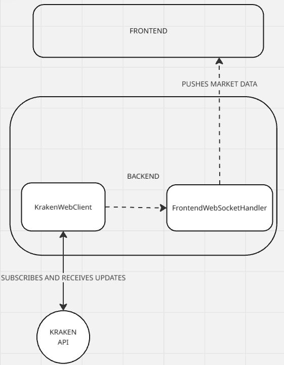

> As more backend instances were added (e.g., to handle more users), **each instance would open a new subscription to Kraken**, leading to:
> - Redundant traffic to the Kraken API
> - Inefficient use of system and network resources
> - Increased risk of hitting API limits or rate caps

---

### 🔸 Second Iteration: Decoupled Kafka-Based Architecture

To solve this scalability issue and improve overall system design, the project was refactored into an **event-driven architecture** using **Apache Kafka**.

#### 🔁 Key Changes:

- ✅ Introduced a dedicated `kraken-ws-service` that connects to Kraken **once** and acts as a **Kafka producer**
- ✅ Backend (`crypto-trading-sim`) becomes a **Kafka consumer**, only responsible for frontend communication
- ✅ Kafka serves as the **single source of truth**, decoupling live data ingestion from distribution

📸 **Diagram: Kafka-Based Microservices Architecture**

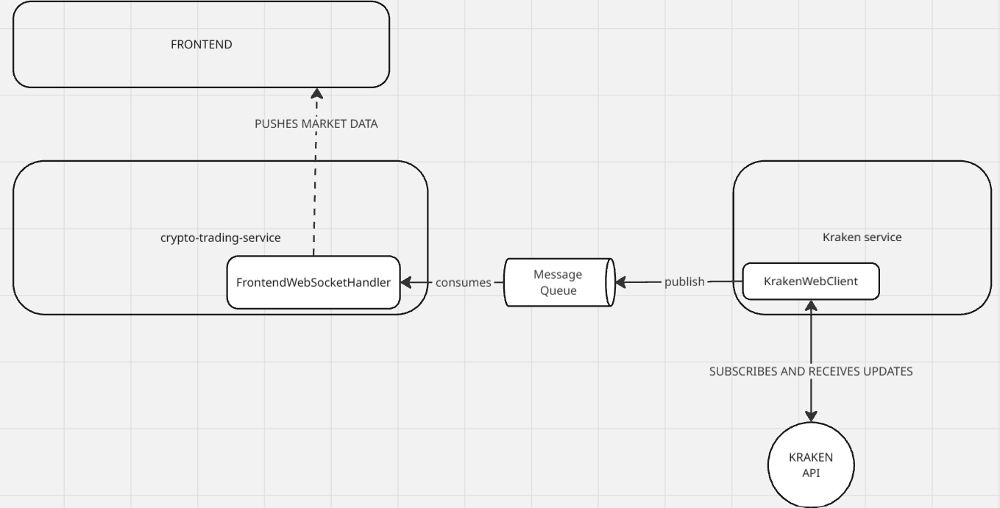

### 🔹 Third Iteration: API Gateway

Introduced a simple API Gateway using Spring WebFlux. At this point to provide simple routing and CORS policy management to the monolith service.
 
Now that the gateway is in place:

- 🧩 The backend can be gradually decomposed into services like `user-service`, `transaction-service`, `marketdata-service`, etc.
- 🔄 Gateway will be updated to route requests using service names instead of static ports
- 🛡 Authentication and rate limiting can be handled globally
- 📊 Observability (e.g., using Sleuth or OpenTelemetry) can be added to trace requests across the system
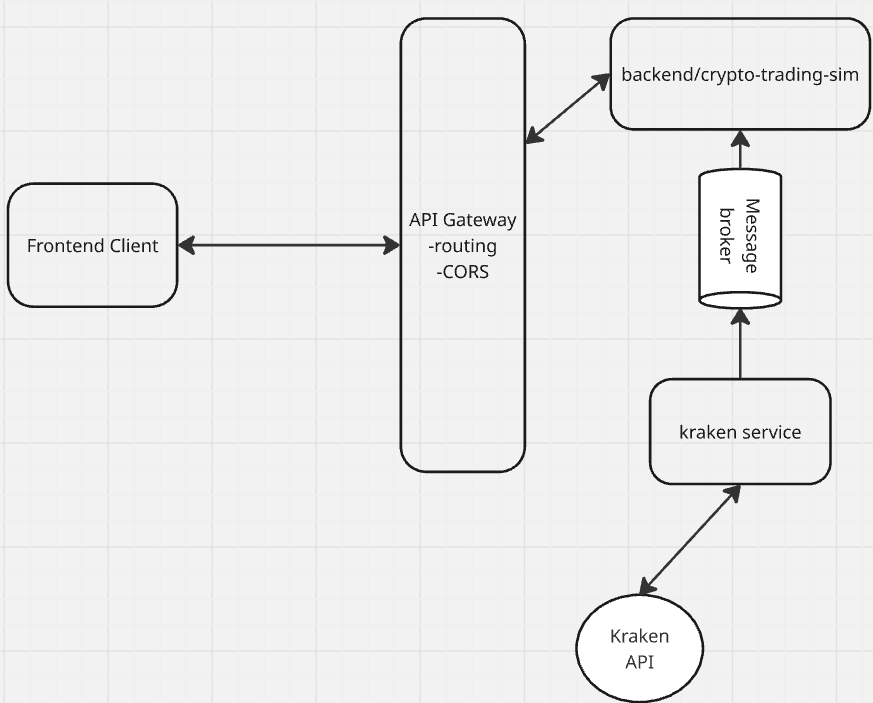


### 🔹 Fourth Iteration: Decoupling the Frontend WebSocket Push Server from the Monolith

To further isolate concerns and improve scalability, a new service called `market-data-streamer` was introduced. This service is responsible solely for **streaming real-time market data to frontend clients over WebSocket**.

#### 🔁 Key Changes:

- ✅ The monolith no longer manages WebSocket sessions for market data.
- ✅ `market-data-streamer` acts as a **Kafka consumer**, receiving market data from the `kraken-ws-service`.
- ✅ It maintains WebSocket sessions with connected frontend clients and pushes updates in real time.
- ✅ This decoupling allows both the market data ingestion and WebSocket streaming layers to scale independently.

#### 🌟 Benefits:

- 📦 **Better separation of concerns** – data ingestion and client communication are now handled by dedicated services.
- 📈 **Scalability** – the streamer service can be horizontally scaled based on user demand without impacting Kraken API usage.
- 🧪 **Easier testing and deployment** – changes to WebSocket logic don’t affect the main trading simulator backend.
- 🧩 **Modularity** – sets the foundation for additional streaming channels or protocol support in the future (e.g., SSE, gRPC streams).

📸 **Diagram: Market Data Streamer Architecture**

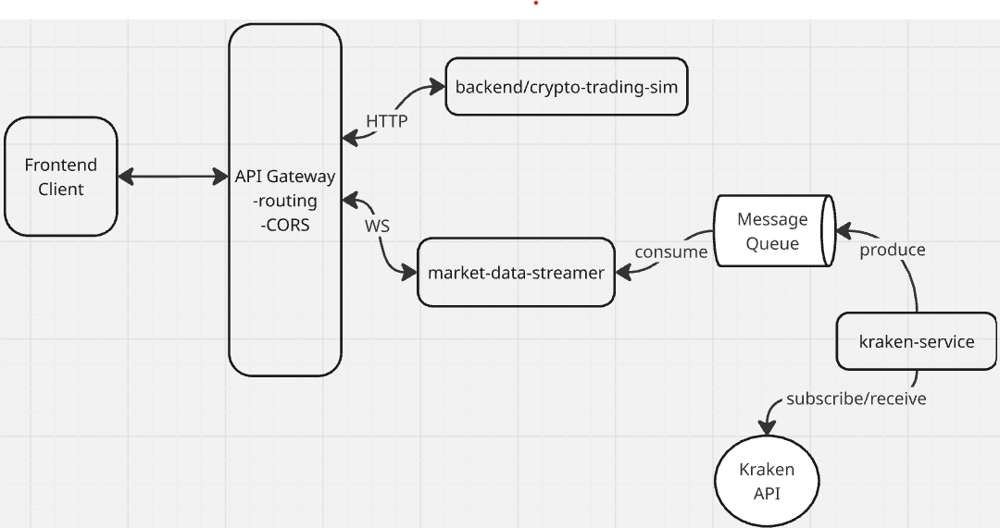

### 🔹 Fifth Iteration: Service Discovery with Eureka Server

To reduce configuration complexity and enable dynamic service lookup, the system introduced **service discovery** using **Spring Cloud Netflix Eureka**.

#### 🔁 Key Changes:

- ✅ Added a **dedicated Eureka Server** to act as a **central registry** for all services
- ✅ `API Gateway`, `market-data-streamer`, and `crypto-trading-sim` now **register themselves** with Eureka upon startup
- ✅ The API Gateway **routes requests** using logical service names (`lb://service-name`) instead of hardcoded IPs or ports
- ✅ Services can now **scale horizontally** and remain discoverable without modifying configuration files

📸 **Diagram: Service Discovery Integration with Eureka**

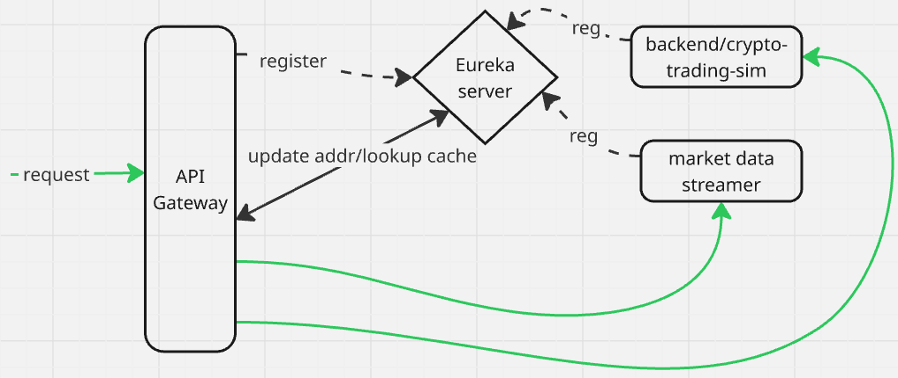

### 🔹 Sixth Iteration: Strangler Pattern — Gradual Decomposition of the Monolith

As part of the system's evolution, we adopted **Martin Fowler’s Strangler Tree Pattern** to incrementally break down the monolith (`crypto-trading-sim`) into dedicated microservices. This approach ensures **stability, availability**, and **progressive migration** without a risky full rewrite.

#### 🔁 Key Changes:

- ✅ The `crypto-trading-sim` monolith **retains core logic** and its internal database schema (`User`, `Holdings`, `Transactions`) to preserve existing behavior.
- ✅ A new `user-service` was introduced to **own user data and balance logic** going forward.
- 🔁 For now, **both systems update user state** (the monolith locally and `user-service` remotely). This **dual-write mechanism** ensures consistency during the transitional phase.
- 📤 Once `user-service` is fully validated in production, the user-related logic and data schema inside `crypto-trading-sim` will be deprecated and removed.

#### 🧠 Why:

- 🧩 **Incremental decomposition** – each microservice (user,holding, transaction, market data) is carved out and hardened before cutting off the corresponding monolith path.
- 🛠 **Stable evolution** – legacy functionality stays intact while new components are independently developed, tested, and deployed.
- 📉 **Reduced risk** – no need for big-bang migrations or downtime-prone rewrites.
- 🔬 **Side-by-side validation** – both the monolith and new services operate in tandem until confidence is gained.

#### 📸 Architecture View:
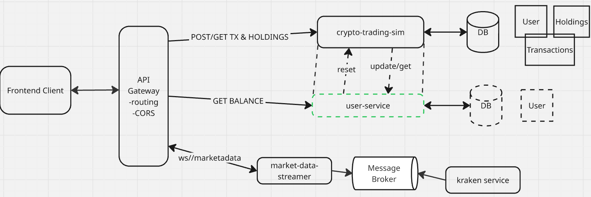
> 📝 **Note:** Eureka service discovery and registration flows were omitted from this diagram for simplicity.


### 🔹 Seventh Iteration: Strangler Pattern — Gradual Decomposition of the Monolith (Holding Service)

As part of the ongoing decomposition, we extracted the logic related to **crypto holdings** into a dedicated `holding-service`.

#### 🔁 Key Changes:

- ✅ `holding-service` now handles the creation, update, and deletion of user holdings.
- ✅ The service is called after a transaction to:
    - Check current quantity for `SELL` transactions
    - Update or insert holding for `BUY` transactions
- 🔁 The monolith (`crypto-trading-sim`) still:
    - Maintains its own copy of holding state
    - Calls `holding-service` for the same update (dual-write)
- 📖 Currently, the frontend reads holdings **only** from `holding-service`.

#### 📝 Considerations for Next Steps:

- ❗️**User ID validation**:
    - Previously enforced via a foreign key constraint (`FOREIGN KEY (user_id) REFERENCES users(id)`)
    - Now, with decoupled services and separate databases, this check is no longer enforced by the DB
    - ⚠️ Risk of updating or querying holdings for a **non-existent user**
    - ✅ We need to enforce **user existence validation** at the application level (e.g., via a call to `user-service`)
#### 📸 Architecture View:
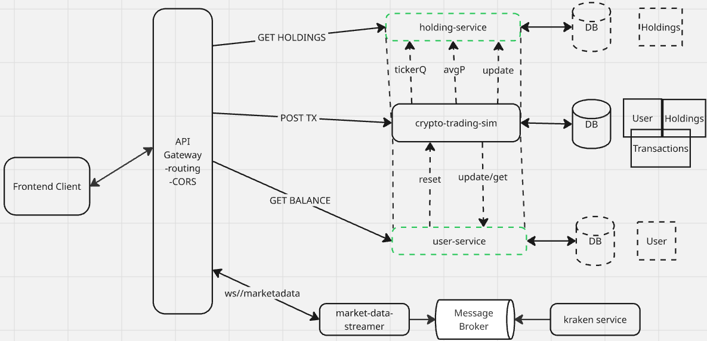

### 🔹 Eighth Iteration: Final Strangler — Complete Microservice Decomposition

The monolithic `crypto-trading-sim` application has now been fully decomposed into dedicated microservices, completing the transition to a modular, scalable architecture. Each service is now responsible for a **single bounded domain**, and the monolith has been retired.

#### 🧩 Final Migration Plan

Following the **Strangler Fig Pattern**, the order of service extraction was determined by **coupling level**, **scalability needs**, and **risk isolation**:

1. **Kraken Service**  
   Was chipped away first due to its **low coupling** and the need for **scaling**. Decoupling Kraken access allowed a single service to handle API subscriptions for all users, eliminating redundant Kraken connections.

2. **Market Data Streamer**  
   Was extracted next because it had **no dependency on business logic**. Its sole responsibility — streaming market data to the frontend — made it ideal for early isolation.

3. **User Service**  
   Came next as it had minimal cross-service logic. It was responsible for **providing and updating user balances**, both for the client and for backend services like `transaction-service`.

4. **Holding Service**  
   Followed due to its relatively **simple coupling** with transaction logic. It manages users' asset holdings and was already a well-scoped part of the domain.

5. **Transaction Service**  
   Was the final and most complex service to extract, as it was **deeply coupled** with both user balances and holdings logic. Its extraction completed the decoupling of all core state transitions.

---

#### ✅ Current State

- 🧩 Each business function now lives in its **own microservice**, with independent databases, deployment pipelines, and scaling profiles.
- 🛠 All communication between services happens via **REST** or **Kafka**, coordinated by the **API Gateway** and **service discovery**.
- 🧹 The monolith has been fully **removed** — both logic and schema — from the system.

📸 **Diagram: Final Microservices Architecture**

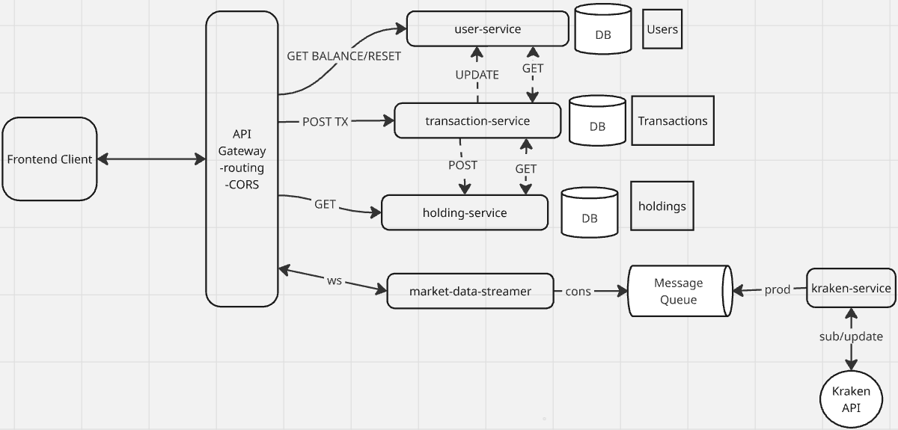

### References

- **Java-WebSocket Library**  
  Used the WS client example to enable WebSocket communication with Kraken's WebSocket V2 API.
   - **Original Repository**: [Java-WebSocket](https://github.com/TooTallNate/Java-WebSocket)
   - **Author**: [TooTallNate](https://github.com/TooTallNate)
   - **License**: [MIT License](https://github.com/TooTallNate/Java-WebSocket/blob/master/LICENSE)

- **WebSocket Server Management (Spring without STOMP)**  
  Referenced for implementing raw Spring WebSocket message broadcasting without STOMP.
    - **Source**: [Stack Overflow Thread](https://stackoverflow.com/questions/33910639/how-to-broadcast-a-message-using-raw-spring-4-websockets-without-stomp)
    - **Answer by**: [novax](https://stackoverflow.com/users/943686/novax)

- **WebSocket + React Tutorial**  
  Used code from the blog to implement the React WS client.
   - **Title**: [How to Use WebSockets with React](https://ably.com/blog/websockets-react-tutorial)
   - **Author**: [Alex Booker](https://github.com/bookercodes)
   - **Published by**: [Ably](https://ably.com)

- **Kafka Docker Setup Guide**  
  Used as a reference for setting up Apache Kafka and Zookeeper using Docker and Docker Compose.
    - **Article**: [Kafka With Docker](https://www.baeldung.com/ops/kafka-docker-setup)
    - **Published by**: [Baeldung](https://www.baeldung.com)

- **Spring Cloud Gateway with Spring WebFlux**  
  Used to understand routing and WebFlux configuration in Spring Cloud Gateway.
    - **Article**: [Spring Cloud Gateway with Spring WebFlux](https://www.geeksforgeeks.org/spring-cloud-gateway-with-spring-webflux/)
    - **Published by**: [GeeksforGeeks](https://www.geeksforgeeks.org)

- **Spring Cloud Service Registration and Discovery Guide**  
  Used to understand how services register and discover each other using Spring Cloud Eureka.
    - **Guide**: [Service Registration and Discovery](https://spring.io/guides/gs/service-registration-and-discovery)
    - **Published by**: [Spring.io](https://spring.io)

- **Microservice Testing Architecture**  
  Used as the primary reference for understanding how testing strategies evolve when migrating to a microservices architecture, especially regarding unit, integration, contract, and end-to-end testing tiers.
    - **Article**: [Microservice Testing](https://martinfowler.com/articles/microservice-testing/#architecture)
    - **Author**: [Martin Fowler](https://martinfowler.com/aboutMe.html)
    - **Published on**: [martinfowler.com](https://martinfowler.com)

- **Strangler Fig Pattern by Martin Fowler**  
  Used as the guiding principle for incrementally refactoring the monolith into microservices without a full rewrite.
    - **Article**: [Strangler Fig Application](https://martinfowler.com/bliki/StranglerFigApplication.html)
    - **Author**: [Martin Fowler](https://martinfowler.com)
