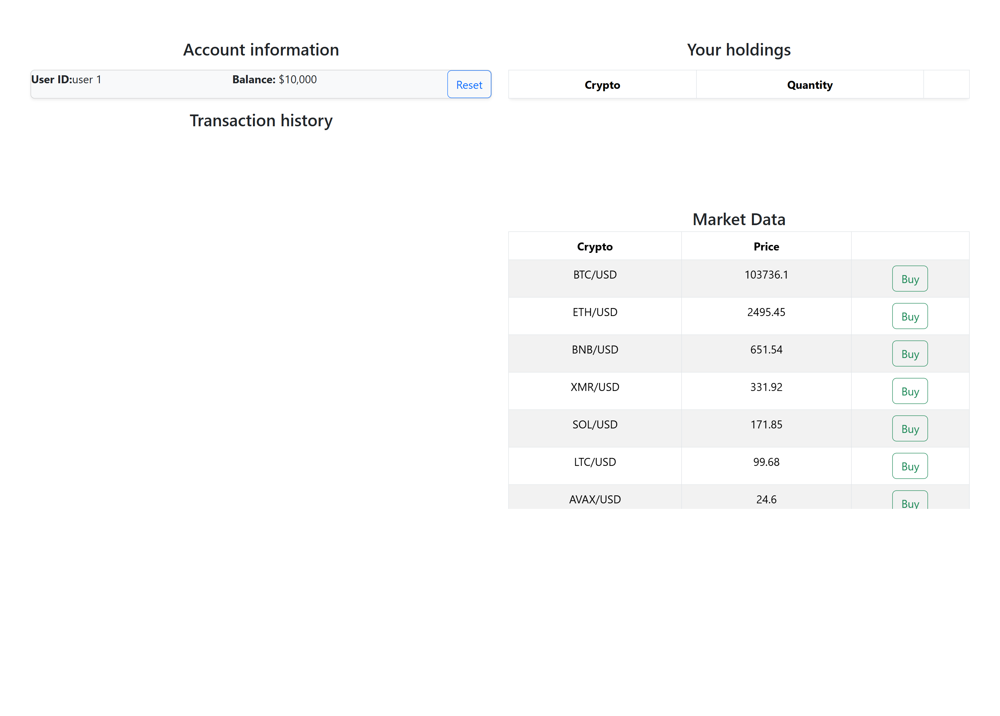

### Requirements

- Java 17.0.6 or newer (Java 17+ required)
- Node.js 18.18.2 or newer
- npm 9.8.1 or newer

### Running the project
1. Navigate to the backend folder and start the Spring Boot server using PS on Windows:

   ```bash
   cd backend/crypto-trading-sim
   .\mvnw spring-boot:run
   ```
   Or if using CMD:
   ```bash
    mvnw spring-boot:run
   ```

2. Open a new terminal, navigate to the frontend folder, and start the React app:

   ```bash
   cd frontend
   npm install    # Only needed the first time
   npm start
   ```


The backend will run on http://localhost:8080

The frontend will run on http://localhost:3000

### Screenshots

#### Initial Application Screen (Top 20 Crypto Prices)

----
#### Buy Interface

----
#### Sell Interface

----
#### Updated Balance After Transaction


----

----

----
### Development Process

1. **Test-Driven Development (TDD) for the Backend**
    Applied TDD for the backend - first stub implementation was defined and then corresponding unit tests were implemented. Aimed for 100% (public) method coverage.
    First repositories and model classes were implemented and tested. Then followed by the service and controller layer.
   > **TDD Commit Examples:**  
   > [Commit 1: Define User & Transaction Repositories](https://github.com/bobelchev/crypto-sim/commit/dbb4594e9dcd0279473dcf389898fae826f77aa6)  
   > [Commit 2: Define CryptoHoldingRepository](https://github.com/bobelchev/crypto-sim/commit/45a4adcafc9b0eeae463841c47786c4f11b55096)  
   > [Commit 3: Implement Unit tests](https://github.com/bobelchev/crypto-sim/commit/45a4adcafc9b0eeae463841c47786c4f11b55096)  
   > [Commit 4: Implement User Repository class](https://github.com/bobelchev/crypto-sim/commit/f1f4e654f1178b225294f874bbf8788089c3d2b3)  
   > [Commit 5: Implement Transaction Repository class](https://github.com/bobelchev/crypto-sim/commit/52f4d371d29f2f8f312774ada86c312b9bc22c83)

2. **Branches**
    Once a stable minimally functional backend was developed the project branched out to develop the fronted and the WS connections.
   > **Branches:**
   > - [`frontend`](https://github.com/bobelchev/crypto-trading-sim/tree/frontend) – Implements the React frontend interface
   > - [`feature/kraken-ws-client`](https://github.com/bobelchev/crypto-trading-sim/tree/feature/kraken-ws-client) – Connects to Kraken WebSocket API and exposes real-time data

3. **Pull Requests**

| Feature                          | Branch             | PR Link                                                      |
|----------------------------------|--------------------|--------------------------------------------------------------|
| Kraken WebSocket Integration     | `feature/kraken-ws-client` | [#5](https://github.com/bobelchev/crypto-trading-sim/pull/5) |
| Frontend UI                      | `frontend`         | [#6](https://github.com/bobelchev/crypto-trading-sim/pull/6) |

### Third-Party Code

- **Java-WebSocket Library**  
  Used the WS client example to enable WebSocket communication with Kraken's WebSocket V2 API.
   - **Original Repository**: [Java-WebSocket](https://github.com/TooTallNate/Java-WebSocket)
   - **Author**: [TooTallNate](https://github.com/TooTallNate)
   - **License**: [MIT License](https://github.com/TooTallNate/Java-WebSocket/blob/master/LICENSE)

- **WebSocket Server Management (Spring without STOMP)**  
  Referenced for implementing raw Spring WebSocket message broadcasting without STOMP.
    - **Source**: [Stack Overflow Thread](https://stackoverflow.com/questions/33910639/how-to-broadcast-a-message-using-raw-spring-4-websockets-without-stomp)
    - **Answer by**: [novax](https://stackoverflow.com/users/943686/novax)

- **WebSocket + React Tutorial**  
  Used code from the blog to implement the React WS client.
   - **Title**: [How to Use WebSockets with React](https://ably.com/blog/websockets-react-tutorial)
   - **Author**: [Alex Booker](https://github.com/bookercodes)
   - **Published by**: [Ably](https://ably.com)

